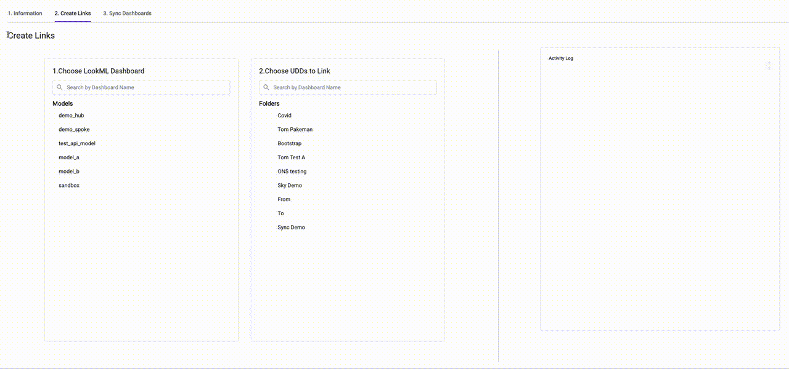

# Looker 'Sync Dashboard' Extension
This is an [extension](https://docs.looker.com/data-modeling/extension-framework/extension-framework-intro) for Looker. 

This allows you to create links between UDDs and LookML dashboards and then 'sync' them, pushing any changes from the LookML into the dashboards.

This is a good solution to the problem of maintaining centrally-controlled dashboards which also live in folders and have the same features as normal UDDs (numerical IDs, folder-based permissions, etc.)

This functionality is currently only possible through the API, hence this extension.

---

*Note: This is not officially supported by Looker or Google in any way. Use at your own risk*

---
### Demo

---

### Installation
* Copy the `manifest.lkml` and `dist/bundle.js` files into your looker environment.

### Development
* Clone this repo --> make changes --> raise a pull request!
* Development requires `yarn`, and installation of `React` and the other normal libraries to develop Looker components
* `yarn dev` runs a local development server where you can preview changes
  * Point the manifest file at `https://localhost:8080/bundle.js` to see this
* `yarn build` webpacks a single js file which you can drag and drop into looker

---

### Known issues
* UDD browser does not do nesting correctly - it only handles a single layer from folder-->dashboard
  * This will be replaced with a proper content browser soon
* Logging overwrites messages within a function instead of appending
* CSS is bad

### Upcoming Features
* Add a visual indicator of which dashboards already have links
  * Use clsx - how to combine this with the selection indicator?
  * Will need to split out UDDs from LookML at this point
  * May be no need for a separate view page? - Just show an info box in the 'make links' section?
* Add a clear log button
* Add icons to show which folder type is which
* Link to successfully synced dashboards
* Colour code log messages